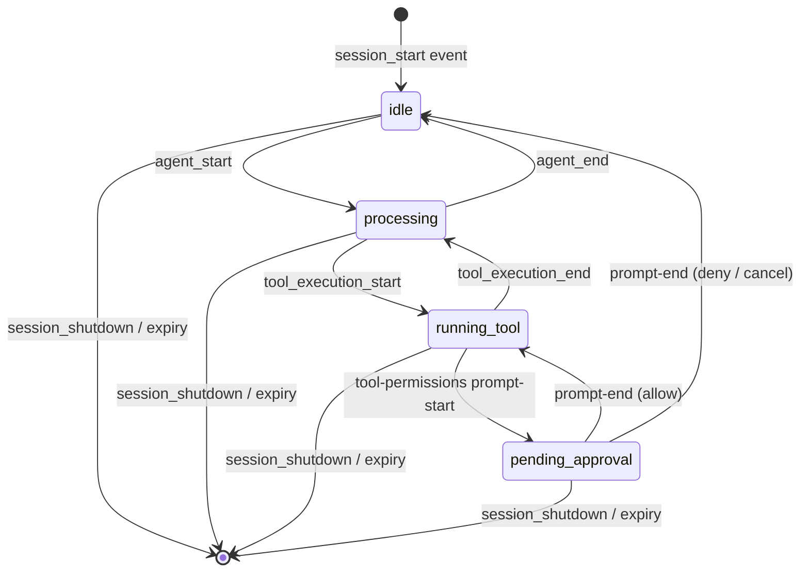

# pi-watch Implementation Plan (Loop Execution)

> **Execution model.** This plan is designed for a Ralph Wiggum Loop. Each **phase** below is executed by a single loop-agent session with a fresh context window. An agent performs every step inside its assigned phase, updates `progress.md`, then hands off to the next phase's agent.

## Overview

Build **pi-watch**: a macOS menu bar application paired with a pi extension. pi-watch shows every active pi session on the machine, surfaces whether each session needs attention (idle, processing, running a tool, waiting for approval), and provides one-click switching to the tmux pane running that session.

Inspired by weaver's `MiniPage`, stripped down to the session-status core. No history browser, session detail view, skills explorer, dictation, or binding adapters.

### Success Criteria

A developer with multiple pi sessions open in tmux panes can, at a glance from the menu bar:

1. See every pi session currently alive, sorted by most recent activity.
2. See per-session activity state (`idle | processing | running_tool | pending_approval`).
3. Click any session row and have tmux `switch-client` retarget their single attached Alacritty window to that pane.
4. Toggle the overlay window visibility with F5.
5. Toggle ghost mode (translucent, click-through overlay) from the tray menu.

### Acceptance Criteria

Mapped to Level 1 ATDD tests.

| ID | Criterion |
|----|-----------|
| AC-1 | Starting a pi session in tmux registers it in pi-watch within one heartbeat interval (<= 5s). |
| AC-2 | Killing a pi process with `SIGKILL` removes it from pi-watch within one expiry window (<= 20s). |
| AC-3 | A clean `Ctrl+D` exit from pi removes the session immediately via the unregister hook. |
| AC-4 | `tool-permissions` showing a prompt transitions the affected session to `pending_approval`, and reverts after the user's decision. |
| AC-5 | Pressing F5 toggles overlay visibility (no flashing, no focus steal, respects aerospace floating layout). |
| AC-6 | Ghost Mode menu item makes the window translucent (0.3 opacity default) and click-through. |
| AC-7 | Clicking a session row with a captured tmux target and exactly one attached tmux client switches the client to that session/window/pane. |
| AC-8 | Clicking a session row when 0 or 2+ tmux clients are attached produces a native macOS notification explaining the no-op. |
| AC-9 | Running pi outside tmux registers the session with `tmuxTarget: null`. Clicking its row produces a notification "session was not started inside tmux". |
| AC-10 | Stopping pi-watch has zero observable effect on running pi sessions. Heartbeats back off to once per minute after N consecutive failures. |
| AC-11 | Removing pi-watch from the system leaves `tool-permissions` fully functional. Its `pi.events` emits become silent no-ops. |

### Assumptions

- macOS only. No Linux / Windows support in v1.
- User runs exactly one attached Alacritty + tmux client at a time when using the click-to-switch feature.
- Weaver is being retired. Port 8143 and the F5 hotkey are free at runtime, though pi-watch uses port 8314.
- The existing pi installation is `@mariozechner/pi-coding-agent`, loaded via `jiti` from `~/.pi/agent/extensions/`.
- The user's existing `tool-permissions` extension at `~/.pi/agent/extensions/tool-permissions/` is the authoritative version; pi-watch cooperates with it via `pi.events`.

### Project locations (authoritative)

Two directories are involved. They serve different purposes and must not be confused.

| Path | Purpose | Who writes it |
|------|---------|---------------|
| `~/Desktop/pi-watch/` | Planning and coordination. Holds `implementation-plan.md`, `progress.md`, and loop logs. | Humans + loop agents (progress.md only). |
| `~/Documents/pi-watch/` | Implementation. Git repo, all code and tests. | Loop agents. Created in Step 1 Subtask 1.1. |

**Loop agents MUST:**

1. Read `~/Desktop/pi-watch/implementation-plan.md` at start-up.
2. Treat `~/Desktop/pi-watch/progress.md` as the shared coordination file. Always edit that copy.
3. All `git`, `npm`, and file-write operations (except progress.md) happen under `~/Documents/pi-watch/`.
4. Do NOT create or update a progress.md inside `~/Documents/pi-watch/`.

### Constraints

- Pi extension code must never crash a coding session. All IPC is best-effort and error-swallowing.
- The Electron window must coexist with aerospace. Requires panel-type, frame-less, `alwaysOnTop`, `skipTaskbar: true`, and a floating layout rule in `aerospace.toml`.
- pi-watch must not require changes to pi itself. It relies only on the public extension API.
- No PID-based liveness detection. pi-watch is stateless about processes; liveness is deduced from heartbeats.
## Agent Context Primer

**Every loop-agent MUST complete this primer before writing any code.**

### 1. Load mandatory skills

Read the base skill, then every linked skill that applies to the current phase. Skills live under `~/.config/ai/skills/` (and some MCP skills under `~/.pi/agent/mcp-skills/`).

| Always load | Phase-specific |
|-------------|----------------|
| `coding-practices/SKILL.md` | `typescript-standards/SKILL.md` for any `.ts`/`.tsx` work |
| `git-commits/SKILL.md` | `backend-coding-practices/SKILL.md` for server / extension / desktop main |
| `testing-practices/SKILL.md` | `frontend-coding-practices/SKILL.md` + `component-decomposition/SKILL.md` for client |
| `development-workflow/SKILL.md` (read-only reference, do NOT re-assess complexity) | `data-safety/SKILL.md` for Step 6 Subtask 6.6 (atomic config write) |

The loop plan is the authority for workflow level. Do not re-assess complexity or prompt the user for clarification on workflow choice. Complexity is fixed at **Complex: ATDD + BDD + TDD**.

### 2. Read the progress file before starting

`~/Desktop/pi-watch/progress.md` is the shared coordination file. It lives next to the implementation plan. Format:

```markdown
# Progress

## Status

| Step | Description | Status |
|------|-------------|--------|
| 1 | Monorepo foundation | ✅ Complete |
| 2 | Fastify server | ⬜ Not started |
...

## Completed tasks
(entries added by agents as they complete steps)

## Notes for Next Agent
(context that would be lost between sessions)

## Open Questions / Blockers
(unresolved issues)
```

An agent picks up the first `⬜ Not started` step, does the work, then sets its status to `✅ Complete`, appends details under "Completed tasks", and adds any handoff context under "Notes for Next Agent" before exiting. If an agent must defer something, append to **Open Questions / Blockers**.

### 3. Reference material paths

**Pi coding agent source (read-only).** Pi is installed as a global npm module. Load topic-specific docs when your phase needs them.

- Package root: `/Users/thompsnt/.config/nvm/versions/node/v22.22.1/lib/node_modules/@mariozechner/pi-coding-agent/`
- `README.md` (top-level)
- `docs/` contents:
  - `extensions.md` — extension API, events, `pi.events` bus, `ExtensionAPI` methods (Step 3, Step 4)
  - `sdk.md` — SDK integration, event bus contract (Step 3, Step 4)
  - `session.md` — SessionManager, `ctx.sessionManager.getSessionId()` (Step 3)
  - `tmux.md` — tmux integration notes (Step 3, Step 6)
  - `themes.md`, `keybindings.md`, `models.md`, `skills.md`, `prompt-templates.md`, `rpc.md`, `custom-provider.md`, `packages.md` — load only if the specific phase touches them
- `examples/` contents:
  - `extensions/event-bus.ts` — reference impl for `pi.events` patterns (Step 4)
  - `extensions/*.ts` — other extension shapes (Step 3 reference)
  - `rpc-extension-ui.ts`, `sdk/` — only if phase needs them

**Weaver reference repo (read-only).** Many patterns in this plan are direct ports.

- Root: `~/Documents/weaver/`
- Monorepo config: `package.json`, `turbo.json`, `tsconfig.base.json`, `eslint.config.mjs` (Step 1)
- Server: `server/src/index.ts`, `server/src/services/event-bus.ts`, `server/src/routes/events/events.ts` (Step 2)
- Desktop: `desktop/src/main.ts`, `desktop/src/window.ts`, `desktop/src/server.ts`, `desktop/src/tray.ts`, `desktop/src/preload.ts`, `desktop/src/config.ts`, `desktop/tsdown.config.ts`, `desktop/package.json` (Step 6)
- Client: `client/src/pages/MiniPage/MiniPage.tsx`, `client/src/pages/MiniPage/MiniActivityLog.tsx`, `client/src/context/ActivityLogContext/ActivityLogContext.tsx`, `client/src/theme/colors.ts` (Step 5)
- Pi binding reference: `bindings/pi/src/extension.ts` (Step 3)
- E2E: `e2e/playwright.config.ts`, `e2e/package.json` (Step 7)

**Tool-permissions extension (live, will be modified in Step 4).**

- Root: `~/.pi/agent/extensions/tool-permissions/`
- Entry: `index.ts` (modified in Step 4 Subtask 4.2)
- Test directory: `__tests__/` (new tests added in Step 4 Subtask 4.1)
- Prompt helper: `permission-prompt.ts` (read to understand prompt timing)

**pi-watch workspace (built by this plan).**

- Root: `~/Documents/pi-watch/` (created in Step 1 Subtask 1.1, absent before)
- Progress file: `~/Desktop/pi-watch/progress.md`
- Config on first app run: `~/Library/Application Support/PiWatch/config.json`

### 4. Development workflow mapping

Phase-level workflow is fixed:

- **Step 1** (foundation): scaffolding only. No tests.
- **Step 2** (server): TDD for `SessionRegistry`, BDD for route behavior, integration test at boundary.
- **Step 3** (extension): TDD for `ActivityTracker`, `captureTmuxTarget`, `HeartbeatClient`; BDD for extension entry wiring.
- **Step 4** (tool-permissions): BDD. Test first, then live edit.
- **Step 5** (client): BDD at the hook and component level. No TDD units.
- **Step 6** (desktop): TDD for `TerminalOpener` pure sub-units and `loadConfig`/`saveConfig`/`applyVisualState`. BDD for tray/F5 behavior through `__piWatchTest` hook.
- **Step 7** (integration + e2e): ATDD. Each Playwright spec maps to one or more AC IDs.

### 5. Commit rules

- One phase = one or more atomic commits. Each commit follows Conventional Commits with scope.
- Subject line <= 50 chars, lowercase, no trailing period.
- Blank line after subject, then body as up to 3 bullets describing what and why.
- Commit granularity: one commit per logical change within a phase. Do NOT squash an entire phase into one commit. Examples:
  - `feat(shared): add session and config types`
  - `test(server): cover session registry expiry`
  - `feat(server): implement session registry`
  - `feat(tool-permissions): emit prompt lifecycle events`
- If the agent must make a cross-cutting fix mid-phase (e.g., correcting an import path across packages), that is a separate commit.

### 6. Brazil / npm

This project is plain npm workspaces. Do **not** use `pnpm`, `yarn`, or `brazil-build`. Never run `brazil-build` — this project is not a Brazil workspace.
## Approach

### High-level architecture

```mermaid
flowchart LR
    subgraph pi["Pi process (one per terminal)"]
        pw_ext[pi-watch extension]
        tp_ext[tool-permissions extension]
        tp_ext -. pi.events .-> pw_ext
    end

    subgraph electron["PiWatch.app (Electron)"]
        server[Fastify server<br/>:8314]
        tray[Tray + F5 + ghost]
        opener[Terminal opener<br/>tmux switch-client]
        client[React client<br/>Tailwind + SWR]
        server <--> tray
        server <--> opener
        server -- SSE --> client
    end

    pw_ext -- "POST /api/sessions/*" --> server
    tmux[tmux server<br/>/tmp/tmux-$UID/default]
    opener -- "execFile tmux" --> tmux
```

### Activity state model



**States:** `idle | processing | running_tool | pending_approval`. A fifth placeholder value `starting` is **not** used: pi does not expose a "loading" signal distinct from the absence of agent activity, and we deliberately avoid a state with no defined transition. Fresh sessions register with activity `idle`.

**Parallel tool execution.** Pi's default mode runs sibling tool calls in parallel. `tool_execution_start` for tool B can fire before `tool_execution_end` for tool A. `ActivityTracker` models this with a counter, not a single flag: each `onToolStart` increments, each `onToolEnd` decrements, and the state transitions to `processing` only when the counter reaches zero. Without the counter, a brief window shows the wrong activity while one tool is still running. See Step 3 Subtask 3.2 for the test cases.

### Heartbeat lifecycle

```mermaid
sequenceDiagram
    participant PI as pi extension
    participant SRV as Server (Electron)
    participant UI as React client

    PI->>SRV: POST /api/sessions/register {sessionId, pid, cwd, tmuxTarget, startTime}
    SRV->>UI: SSE session:added
    loop every 5s
        PI->>SRV: POST /api/sessions/heartbeat {sessionId, activity, lastEventTime, tmuxTarget?}
        SRV-->>SRV: update lastSeen + tmuxTarget; if activity changed, SSE session:updated
    end
    Note over PI: pi process exits (clean)
    PI->>SRV: POST /api/sessions/unregister {sessionId}
    SRV->>UI: SSE session:removed
    Note over PI: OR pi process killed (no clean shutdown)
    loop every 5s (server reaper)
        SRV-->>SRV: drop entries where now - lastSeen > 15s
    end
    SRV->>UI: SSE session:removed
```

### Click-to-switch flow

```mermaid
sequenceDiagram
    participant UI as React client
    participant EL as Electron main
    participant SRV as Server (in-process)
    participant OP as TerminalOpener
    participant TX as tmux CLI
    participant OS as osascript

    UI->>EL: IPC pw:open-session {sessionId}
    EL->>SRV: POST /api/open-terminal {sessionId}
    SRV-->>EL: { session, tmuxTarget } | { error }
    EL->>OP: open(tmuxTarget)
    alt tmuxTarget == null
        OP->>OS: display notification "session was not started inside tmux"
    else tmux list-clients fails
        OP->>OS: display notification "tmux server not running"
    else 0 clients attached
        OP->>OS: display notification "no tmux client attached"
    else 2+ clients attached
        OP->>OS: display notification "multiple tmux clients; detach extras and retry"
    else exactly 1 client
        OP->>TX: switch-client -c <client> -t <session>:<window>.<pane>
    end
```

**Single-command switch.** tmux accepts a fully-qualified pane target (`session:window.pane`) as the `-t` argument to `switch-client` directly, which retargets client, window, and pane in one call. No `;` command chain is needed. This is one `execFile` invocation with predictable argv and no literal shell separators to escape.

**Tmux target freshness.** `tmuxTarget` is refreshed on every heartbeat, not only at `session_start`. If the user breaks the pane out, swaps panes, or renames the session, the stored target lags by at most one heartbeat interval (5s). `captureTmuxTarget` is cheap (one `tmux display-message` exec per session per heartbeat). See Step 3 Subtask 3.3 and Subtask 3.6 for the wiring.

### Key decisions and rationale

| Decision | Why |
|----------|-----|
| Separate Electron app + HTTP server | Extension's only job is to report state. All UI, aggregation, and lifecycle logic stays in Electron. |
| Heartbeat registry, no PIDs | Pi's public API doesn't expose liveness. Heartbeats give a clean, portable signal. PIDs leak implementation details. |
| 5s heartbeat / 15s expiry | Industry-standard 3x ratio. Detects crashes within 20s worst case without flooding loopback. |
| Backoff to 60s after the 3rd consecutive failure | Keeps idle pi processes from pegging on retries when pi-watch is not running. Resumes 5s cadence on next success. The 3rd failed attempt itself fires at the 5s cadence; the 4th attempt (and subsequent failed attempts) fires at the 60s cadence until one succeeds. |
| Tool-permissions cooperation via `pi.events` | `emit()` with no listeners is a silent no-op. pi-watch absent = tool-permissions unaffected. No coupling. |
| Turbo monorepo (npm workspaces) | Matches weaver's structure. Fast incremental builds during development. |
| Tailwind instead of Cloudscape | Cloudscape was over-engineered for weaver's minimal UI surface. pi-watch has 1 screen, ~100 lines of JSX. |
| tmux switch-client (not alacritty -e) | User already has Alacritty open. `-e` opens a new window; `switch-client` retargets the existing one. |
| Port 8314 | "pi ≈ 3.14". No collision with weaver (8143) or common dev ports. |

### Alternatives considered

| Alternative | Rejected because |
|-------------|------------------|
| Poll `~/.pi/agent/sessions/**/*.jsonl` mtime | Doesn't distinguish "pi process alive" from "session file on disk". |
| PID-based liveness (weaver's approach) | Platform-specific, breaks on tmux / background pi, requires SessionManager metadata pi doesn't expose. |
| Single shared `node:cluster` in the extension | Extensions are per-pi-process. Any "first pi owns the server" scheme is racy. |
| WebSockets instead of SSE | SSE is one-way server-to-client, which is all we need. Less machinery. |
| Adaptive heartbeat cadence (5s active / 30s idle) | Premature optimization. Measured overhead is negligible. |

### Development workflow

| Signal | Assessment |
|--------|------------|
| Scope | Cross-process: pi extension + Electron main + React client. Multi-module. |
| Logic | Heartbeat expiry, activity state machine, backoff, tmux command building, ghost-mode visual state. |
| State | Session registry with TTL, SSE connection, ghost toggle, F5 toggle, config persistence. |
| Dependencies | pi extension API, `tool-permissions` extension, `alacritty`, `tmux`, macOS `osascript`, aerospace. |
| Ambiguity | Resolved in discovery phase. |

**Complexity: Complex. Applying Levels 1 + 2 + 3 (ATDD + BDD + TDD).** This is the authoritative workflow choice. Loop agents must not re-assess.

### Pinned dependency versions (copied from weaver)

These versions are authoritative. Each loop agent must use exactly these when editing `package.json`.

| Dep | Version | Scope |
|-----|---------|-------|
| `electron` | `^35.0.0` | desktop |
| `electron-builder` | `^26.8.1` | desktop devDep |
| `fastify` | `^5.3.3` | server |
| `@fastify/static` | `^9.0.0` | server |
| `zod` | `^4.3.6` | server |
| `react` | `^19.1.0` | client |
| `react-dom` | `^19.1.0` | client |
| `swr` | `^2.4.1` | client |
| `vite` | `^6.3.4` | client devDep |
| `@vitejs/plugin-react` | `^4.4.1` | client devDep |
| `tailwindcss` | `^3.4.0` | client devDep (plan original) |
| `postcss` | `^8.4.0` | client devDep |
| `autoprefixer` | `^10.4.0` | client devDep |
| `@types/react` | `^19.1.2` | client devDep |
| `@types/react-dom` | `^19.1.2` | client devDep |
| `@testing-library/react` | `^16.3.2` | client devDep |
| `@testing-library/jest-dom` | `^6.9.1` | client devDep |
| `jsdom` | `^28.1.0` | client devDep |
| `turbo` | `^2.4.0` | root devDep |
| `tsdown` | `^0.21.0` | server/desktop/extension devDep |
| `typescript` | `^5.8.3` | all packages devDep |
| `vitest` | `^4.0.18` | server/client/extension devDep |
| `tsx` | `^4.19.4` | server devDep |
| `@types/node` | `^22.15.3` | all packages devDep |
| `@playwright/test` | `^1.58.2` | e2e devDep |
| `playwright` | `^1.58.2` | e2e devDep |
| `@eslint/js` | `^10.0.1` | root devDep |
| `eslint` | `^10.0.3` | root devDep |
| `typescript-eslint` | `^8.57.0` | root devDep |
| `@mariozechner/pi-coding-agent` | `*` | extension peer/devDep (provided at runtime) |

Node `engines`: `>=20`.
## Implementation Steps

Each phase below is executed by a single loop-agent. An agent claims the phase in `progress.md`, performs every step in order, makes commits as indicated, runs the phase-level acceptance check, updates `progress.md` with completion status, and exits.

---

### Step 1: Monorepo foundation

**Workflow level:** scaffolding (no tests)
**Depends on:** nothing
**Phase-level acceptance:**
- `~/Documents/pi-watch/` exists with git initialized on branch `main`.
- `npm install` at root completes without errors.
- `npm run build` from root executes (even if individual packages are empty builds).

#### Subtask 1.1: Initialize repo and monorepo root

- Create directory `~/Documents/pi-watch/`.
- `git init` on branch `main`.
- Write `.gitignore` with standard Node entries: `node_modules/`, `dist/`, `.turbo/`, `*.log`, `.DS_Store`, `coverage/`, `test-results/`, `~/Library/Application Support/PiWatch/`.
- Write root `package.json`:
  - `"name": "pi-watch"`, `"private": true`, `"version": "0.1.0"`.
  - `"workspaces": ["shared", "server", "client", "desktop", "extension", "e2e"]`.
  - `"packageManager": "npm@10.8.2"`.
  - `"engines": { "node": ">=20" }`.
  - Scripts: `dev`, `build`, `test`, `lint`, `app` (build then start electron), `dist`.
  - DevDeps: `turbo`, `eslint`, `@eslint/js`, `typescript-eslint` at versions listed in the pinned table.
- Write `turbo.json` copied from weaver with the same pipeline entries (`build`, `test`, `test:e2e`, `dev`).
- Write `tsconfig.base.json` copied from weaver verbatim.
- Write `eslint.config.mjs` copied from weaver verbatim.
- Commit: `chore: initialize monorepo root` with body describing the workspace layout.

#### Subtask 1.2: Create `shared/` package

- Directory layout:
  ```
  shared/
  ├── package.json         { "name": "@pi-watch/shared", "private": true, "type": "module", "main": "src/index.ts" }
  ├── tsconfig.json        extends ../tsconfig.base.json
  └── src/
      ├── index.ts         re-exports everything
      ├── types/
      │   ├── session.ts   ActivityStatus, RegisteredSession, HeartbeatPayload, SSEEvent
      │   └── config.ts    PiWatchConfig + DEFAULT_CONFIG
      ├── constants.ts     SERVER_PORT=8314, MAX_VISIBLE_SESSIONS=5, MAX_ACTIVITY_LOG_ENTRIES=10, HEARTBEAT_INTERVAL_MS=5000, HEARTBEAT_EXPIRY_MS=15000, FAILURE_THRESHOLD=3, BACKOFF_INTERVAL_MS=60000
      └── paths.ts         getConfigPath(), getLogDir()
  ```
- Types MUST be separate from any behavior (no imports from runtime modules). `paths.ts` may use `node:os` and `node:path`.
- `ActivityStatus` is a string literal union: `"idle" | "processing" | "running_tool" | "pending_approval"`.
- `SSEEvent` is a discriminated union `{ type: "session:added" | "session:updated" | "session:removed"; session: RegisteredSession | { sessionId: string } }`.
- Commit: `feat(shared): add session and config types`.

---

### Step 2: Fastify server

**Workflow level:** TDD for `SessionRegistry` and reaper; BDD for routes; integration test.
**Depends on:** Step 1 (shared types, tsconfig, root scripts).
**Phase-level acceptance:**
- `npm run test --workspace server` is green.
- `npm run build --workspace server` produces `server/dist/index.mjs`.
- `node server/dist/index.mjs` boots, serves `GET /api/health` → `{ ok: true }` on port 8314, then exits on SIGTERM cleanly.
- An integration test hits real HTTP on an ephemeral port and verifies the full register → heartbeat → SSE → reap flow.

#### Subtask 2.1: Server scaffolding

- Create `server/` with `package.json`, `tsconfig.json`, `tsconfig.build.json`, `tsdown.config.ts`, `vitest.config.ts`. Match weaver's server shape.
- `package.json` depends on `@pi-watch/shared` (workspace protocol), `fastify`, `@fastify/static`, `zod` at pinned versions. Dev deps: `tsdown`, `tsx`, `typescript`, `vitest`, `@types/node`.
- **`@fastify/static` purpose.** The server serves the built client bundle at `/` so Electron can `loadURL("http://127.0.0.1:8314/")`. In Subtask 2.8 the index file wires:
  ```ts
  import fastifyStatic from "@fastify/static";
  import { resolve } from "node:path";
  const clientDist = process.env.PI_WATCH_CLIENT_DIST ?? resolve(__dirname, "../../client/dist");
  await app.register(fastifyStatic, { root: clientDist, prefix: "/", decorateReply: false });
  ```
  In dev mode, the client runs under Vite (Step 5) and proxies `/api/*` to 8314, so the static mount is a no-op unless the client has been built. In packaged mode, Electron sets `PI_WATCH_CLIENT_DIST` to `process.resourcesPath + "/client/dist"` (see Step 6 Subtask 6.2).
- `server/src/index.ts`:
  - Creates Fastify instance with `ajv: { customOptions: { coerceTypes: false } }`.
  - Listens on `127.0.0.1:8314` (loopback only).
  - Structured error handler logs to stdout JSON.
  - Graceful SIGINT/SIGTERM shutdown closes server.
  - Stdin-end handler mirrors weaver's pattern so child survives parent crash semantics.
- `server/src/utils/logger.ts`: exported `log(entry)` function, stdout JSON, mirrors weaver's logger contract.
- `server/src/routes/health.ts`: `GET /api/health` → `{ ok: true }`.
- Commit: `feat(server): scaffold fastify boot and health route`.

#### Subtask 2.2: `SessionRegistry` unit tests (TDD Red)

- `server/src/session-registry.test.ts`. Follow `testing-practices` sociable-by-default rule. No mocks beyond injected clock.
- Cover:
  1. `register` stores entry and fires `onChange("added", entry)` exactly once.
  2. `heartbeat` for an unknown id upserts a new entry (server-restart recovery).
  3. `heartbeat` updates `lastSeen` but only fires `onChange("updated")` when `activity` changes.
  4. `heartbeat` with a new `tmuxTarget` updates the stored entry's target (silent update, no `onChange` unless activity also changed).
  5. `unregister` removes the entry and fires `onChange("removed", entry)`.
  6. `reap(now)` removes every entry with `now - lastSeen > expiryMs`, fires one `removed` event per entry.
  7. `list()` returns a readonly snapshot sorted by `lastEventTime` desc.
  8. Clock injection lets tests advance time deterministically without real timers.
- Commit: `test(server): cover session registry behavior`.

#### Subtask 2.3: `SessionRegistry` implementation (TDD Green)

- `server/src/session-registry.ts`:
  - Class or closure over `Map<sessionId, Entry>`.
  - Constructor accepts `{ now: () => number, expiryMs: number }`.
  - `onChange` subscription API: `onChange(listener: (kind, entry) => void): () => void`.
  - Pure: no `setInterval` inside. Reaper schedules calls externally.
  - Use functional iteration (`map`, `filter`, `reduce`) per `typescript-standards`.
- Run tests from B2. Fix until green.
- Commit: `feat(server): implement session registry`.

#### Subtask 2.4: REST routes and Zod schemas

- `server/src/routes/sessions.ts`:
  - `POST /api/sessions/register` body `{ sessionId, pid, cwd, tmuxTarget, startTime, agentName? }` → `{ ok: true }`.
  - `POST /api/sessions/heartbeat` body `{ sessionId, activity, lastEventTime, tmuxTarget? }` → `{ ok: true }`. `tmuxTarget` is optional; when present the registry updates the stored target (keeps it fresh across pane moves and session renames).
  - `POST /api/sessions/unregister` body `{ sessionId }` → `{ ok: true }`.
  - `GET /api/sessions` → snapshot.
- `server/src/schemas.ts`: Zod schemas for each body. Plug into Fastify via the same `zodBody` helper pattern weaver uses (or copy the helper).
- `server/src/routes/sessions.test.ts`: BDD-style scenarios, real Fastify instance via `server.inject()`.
  - Given empty registry, when I POST register, then GET /api/sessions returns the entry.
  - Given a registered session, when I POST heartbeat with same activity, then no updated event (observe via a subscribed listener attached through an exported hook).
  - Given a registered session, when I POST heartbeat with different activity, then updated event fires.
  - Given a registered session, when I POST unregister, then GET /api/sessions returns an empty array.
  - Given any body, when Zod validation fails, then route returns 400.
- Commit: `feat(server): expose session REST routes with zod validation`.

#### Subtask 2.5: SSE events endpoint

- `server/src/event-bus.ts`: lightweight typed event bus. Port the shape from `weaver/server/src/services/event-bus.ts` but narrow to pi-watch's needs. Do NOT import weaver's code.
- `server/src/routes/events.ts`: `GET /api/events` opens SSE (`Content-Type: text/event-stream`, `Cache-Control: no-cache`, `Connection: keep-alive`). Heartbeat comment `:\n\n` every 15s.
- Wire `SessionRegistry.onChange` so each change is published as `event: session:added|updated|removed` with `data: <JSON>`.
- Test (sociable, real HTTP): boot server on ephemeral port, open SSE, POST a register, assert an SSE frame arrives within 1s and contains the expected entry.
- Commit: `feat(server): broadcast registry changes over sse`.

#### Subtask 2.6: Reaper loop

- `server/src/reaper.ts`: `createReaper({ registry, intervalMs, now })` returns `{ start, stop }`. Uses `setInterval` internally.
- Wire `start()` from `index.ts`; call `stop()` during shutdown sequence.
- Tests use vitest fake timers (`vi.useFakeTimers()` + `vi.advanceTimersByTime()`) to drive the reaper deterministically. Do not hand-roll `setInterval`/`clearInterval` injection: vitest's fake timers already mock them globally when enabled.
- Commit: `feat(server): add session reaper loop`.

#### Subtask 2.7: Open-terminal and permission-events endpoints

- `server/src/routes/open-terminal.ts`: `POST /api/open-terminal` body `{ sessionId }`. Looks up entry, returns `{ ok: false, reason }` if missing or if `tmuxTarget` is null. Does NOT spawn anything from the server. The Electron main process will receive this lookup result via the shared in-process event bus or direct function call (see Step 6 Subtask 6.10 for wiring). For now, export a `resolveOpenTarget(sessionId)` function that returns `{ session, tmuxTarget } | { error }`; the route returns that structure.
- `server/src/routes/permission-events.ts`:
  - `POST /api/sessions/:id/permission-prompt-start` → registry marks activity `pending_approval`.
  - `POST /api/sessions/:id/permission-prompt-end` → registry reverts activity to the pre-prompt value (registry must support a small stack per-entry OR the route just marks activity `running_tool` and lets the extension's next heartbeat correct it within 5s; choose the simpler second option and document it inline).
- Tests: BDD scenarios driven by `server.inject()` against a real registry.
- Commit: `feat(server): expose open-terminal and permission endpoints`.

#### Subtask 2.8: Register routes in `index.ts` and add integration test

- `server/src/index.ts` calls `registerHealthRoute`, `registerSessionRoutes`, `registerEventRoutes`, `registerOpenTerminalRoute`, `registerPermissionRoutes`, and starts the reaper.
- `server/src/__tests__/integration.test.ts`: boot real Fastify on an ephemeral port, run the full flow: register → heartbeat with activity change → SSE received → unregister → SSE removed frame received.
- Commit: `test(server): add end-to-end integration test`.
---

### Step 3: Pi extension

**Workflow level:** TDD for pure units, BDD for the entry wiring.
**Depends on:** Step 1 (shared types), Step 2 (routes the extension will POST to).
**Phase-level acceptance:**
- `npm run test --workspace extension` is green.
- `npm run build --workspace extension` produces `extension/dist/index.js`.
- A manual smoke test: run a throwaway node script that loads `extension/dist/index.js` with a mock `pi` API, emits `session_start`, and confirms the extension makes an HTTP POST to `http://127.0.0.1:8314/api/sessions/register` (verified by netcat listener).

#### Subtask 3.1: Extension scaffold

- Directory layout:
  ```
  extension/
  ├── package.json      { "name": "pi-watch-extension", "private": true, "type": "module", "pi": { "extensions": ["./dist/index.js"] } }
  ├── tsconfig.json
  ├── tsdown.config.ts  bundles dist/index.js as ESM
  ├── vitest.config.ts
  └── src/
      ├── index.ts         entry (wired in Subtask 3.7)
      ├── activity-tracker.ts
      ├── tmux-target.ts
      └── heartbeat-client.ts
  ```
- DevDep: `@mariozechner/pi-coding-agent` at `*`, `typescript`, `tsdown`, `vitest`, `@types/node`.
- Build output is `dist/index.js` because pi's `jiti` runtime can load the prebuilt JS with less compile overhead on hot paths.
- Commit: `feat(extension): scaffold pi-watch extension package`.

#### Subtask 3.2: `ActivityTracker` tests + implementation (TDD)

- Read `extensions.md` in the pi docs to confirm the event names used (`session_start`, `agent_start`, `agent_end`, `tool_execution_start`, `tool_execution_end`, `session_shutdown`).
- **State vocabulary:** `ActivityStatus = "idle" | "processing" | "running_tool" | "pending_approval"`. No `"starting"` state: fresh trackers begin at `idle` (see Approach → Activity state model).
- **Parallel-tool handling:** the tracker keeps an internal integer `runningTools` counter. `onToolStart` increments it and sets activity to `running_tool`. `onToolEnd` decrements and transitions back to `processing` only when the counter reaches zero.
- **Permission stack:** `onPermissionStart` pushes the current activity onto a stack and sets activity to `pending_approval`. `onPermissionEnd` pops and restores. Nested starts/ends pop in correct order.
- `activity-tracker.test.ts` covers:
  - Fresh tracker: state is `idle`.
  - `onAgentStart` → `processing`.
  - `onToolStart` → `running_tool`.
  - Two `onToolStart` calls followed by one `onToolEnd`: activity remains `running_tool` (counter is 1).
  - Two `onToolStart` calls followed by two `onToolEnd` calls: activity is `processing` (counter is 0, restores prior).
  - `onToolEnd` from `running_tool` with counter already 0 is a no-op (defensive: we've seen an unmatched end).
  - `onAgentEnd` from `processing` → `idle`.
  - `onPermissionStart` from any state pushes onto the stack and transitions to `pending_approval`.
  - `onPermissionEnd` pops the stack back to the prior state.
  - Nested permission starts (two in a row) pop correctly back to the original underlying state.
  - `snapshot()` returns `{ activity, lastEventTime }` where `lastEventTime` is an ISO string, updated on every transition.
- `activity-tracker.ts`: implement a class with fields `activity: ActivityStatus`, `runningTools: number`, `permissionStack: ActivityStatus[]`.
- Commit: `feat(extension): add activity state tracker with tests`.

#### Subtask 3.3: `captureTmuxTarget` tests + implementation (TDD)

- Read pi `docs/tmux.md` if it contains relevant notes on how pi interacts with tmux.
- `tmux-target.ts` signature:
  ```ts
  export type TmuxTarget = { session: string; window: string; pane: string; target: string };
  export type Exec = (cmd: string, args: string[]) => Promise<{ stdout: string; code: number }>;
  export function captureTmuxTarget(env: NodeJS.ProcessEnv, exec: Exec): Promise<TmuxTarget | null>;
  ```
  `target` is the precomputed `"<session>:<window>.<pane>"` string (used directly as `tmux -t`).
- Behavior:
  - Returns `null` if `env.TMUX` is unset or empty.
  - Otherwise invokes `exec("tmux", ["display-message", "-p", "#S:#I.#P"])`. Parses `session:window.pane`.
  - If exec fails, returns non-zero, or stdout does not match the expected format, returns `null` (never throws).
- Tests inject fake `exec` covering: happy path, `TMUX` missing, exec throws, exec returns non-zero, stdout malformed.
- **Performance note:** this function is called at `session_start` AND on every heartbeat (see Subtask 3.6) to keep `tmuxTarget` fresh. One `tmux display-message` exec per session per 5s is trivial overhead. Tests should not mock `exec` with artificial delays.
- Commit: `feat(extension): capture tmux target from environment`.

#### Subtask 3.4: `HeartbeatClient` tests (TDD Red)

- `heartbeat-client.test.ts`. Inject a fake HTTP client (a function matching a subset of `node:http` request semantics) and a fake clock (`{ now: () => number, setInterval, clearInterval }`).
- Cover:
  - `register({...})` issues a POST to `/api/sessions/register` with the correct body and Content-Type.
  - `startHeartbeats(getSnapshot)` schedules a first heartbeat at `HEARTBEAT_INTERVAL_MS`.
  - After 3 consecutive failures the next scheduled interval is `BACKOFF_INTERVAL_MS` (60000 ms).
  - A successful request resets the interval to `HEARTBEAT_INTERVAL_MS`.
  - `stopHeartbeats()` clears the timer; no further heartbeats fire.
  - `unregister(sessionId)` issues a POST and resolves even if the server 500s.
  - `postPermissionStart(sessionId)` / `postPermissionEnd(sessionId)` issue POSTs to the correct per-session URLs.
  - All methods swallow network errors.
- **Timer strategy:** use `vi.useFakeTimers()` + `vi.advanceTimersByTimeAsync()` rather than hand-rolled `setInterval` injection. Vitest's fake timers handle `unref()` transparently and produce cleaner test output. The failure-counter and cadence-switch behavior is tested by: stubbing the HTTP client to reject three times, advancing time, then asserting the next scheduled delay equals `BACKOFF_INTERVAL_MS`.
- Commit: `test(extension): specify heartbeat client behavior`.

#### Subtask 3.5: `HeartbeatClient` implementation (TDD Green)

- `heartbeat-client.ts`:
  - Uses `node:http` (not `fetch`) with `keep-alive` agent and 2s per-request timeout.
  - `post(path, body)` is a private helper returning `Promise<{ ok: boolean }>`. Always resolves; never rejects.
  - `startHeartbeats` owns an internal failure counter. On success, reset to 0 and cadence back to `HEARTBEAT_INTERVAL_MS`. On failure, increment; when counter reaches 3, switch cadence to `BACKOFF_INTERVAL_MS`.
  - Timer created via `setInterval(...)`.unref() so pi can exit cleanly even if pi-watch is down.
  - Run C4 tests until green.
- Commit: `feat(extension): implement heartbeat client with backoff`.

#### Subtask 3.6: Extension entry wiring (BDD)

- `src/index.ts` default export function receives `pi: ExtensionAPI`. Wire up:
  - `pi.on("session_start", ...)`: capture `sessionId` and `cwd` from context, call `captureTmuxTarget`, `client.register({ sessionId, pid: process.pid, cwd, tmuxTarget, startTime: new Date().toISOString() })`, then `client.startHeartbeats(snapshot)`.
  - `snapshot` is a closure that, each call, re-captures the tmux target and returns:
    ```ts
    async () => ({
      sessionId,
      tmuxTarget: (await captureTmuxTarget(process.env, exec)) ?? lastKnownTmuxTarget,
      ...tracker.snapshot(),
    });
    ```
    The fallback to `lastKnownTmuxTarget` handles transient tmux-command failures: we keep the previous value rather than dropping to `null` on a single hiccup. `null` is only stored once at register time if the process was never inside tmux.
  - `pi.on("agent_start", ...)`: `tracker.onAgentStart()`.
  - `pi.on("tool_execution_start", ...)`: `tracker.onToolStart()`.
  - `pi.on("tool_execution_end", ...)`: `tracker.onToolEnd()`.
  - `pi.on("agent_end", ...)`: `tracker.onAgentEnd()`.
  - `pi.events.on("pi-watch:permission-prompt-start", ({ sessionId }) => { tracker.onPermissionStart(); client.postPermissionStart(sessionId); })`.
  - `pi.events.on("pi-watch:permission-prompt-end", ({ sessionId }) => { tracker.onPermissionEnd(); client.postPermissionEnd(sessionId); })`.
  - `pi.on("session_shutdown", ...)`: `client.stopHeartbeats(); await client.unregister(sessionId);`.
- Every handler wrapped in try/catch. A failing handler logs to stderr but never throws.
- **Mode behavior:** pi-watch registers in all modes (interactive, RPC, JSON, print). Print-mode sessions are short-lived: they register, heartbeat once or not at all, then unregister on shutdown. The session may appear briefly in the overlay and then disappear. This is expected and documented here so no future agent treats it as a bug.
- BDD test `src/index.test.ts`: construct a fake `pi` object with `on`, `events: new EventEmitter()`, feed synthetic events, assert on the fake HTTP client injected into `HeartbeatClient`. Include a test that the heartbeat `snapshot` callback re-runs `captureTmuxTarget` (not just reads a cached value).
- Commit: `feat(extension): wire lifecycle events to heartbeat client`.

#### Subtask 3.7: Build and manual smoke test

- Run `npm run build --workspace extension`.
- Start a `nc -lk 8314` listener in a scratch terminal (document this in the commit body).
- Run a throwaway node script that imports `extension/dist/index.js`, invokes the default export with a mock `pi`, fires a synthetic `session_start`, and verifies netcat receives a POST line.
- Commit: `chore(extension): document manual smoke test procedure` (add a short `extension/README.md` with the procedure). No code changes beyond the README.

---

### Step 4: Tool-permissions cooperation (live edit)

**Workflow level:** BDD. Tests first, then live edit.
**Depends on:** Step 3 (defines the `pi.events` event names).
**Phase-level acceptance:**
- Two new passing tests in `~/.pi/agent/extensions/tool-permissions/__tests__/`.
- All pre-existing tests in that directory still pass.
- Live `index.ts` modified with guarded `pi.events.emit` calls surrounding `promptPermission`.

#### Subtask 4.1: Add tests to tool-permissions

- File: `~/.pi/agent/extensions/tool-permissions/__tests__/pi-events.test.ts`.
- Subscribe to a local `EventEmitter` fake substituted as `pi.events`. Verify:
  - Given tool-permissions is evaluating a tool that requires prompting, when the prompt shows, then `pi-watch:permission-prompt-start` is emitted first with `{ sessionId, toolName, description }`.
  - Given the user makes a decision, when the prompt resolves, then `pi-watch:permission-prompt-end` is emitted with `{ sessionId, decision }` where decision is one of `"allow-once" | "allow-session" | "deny" | "cancel"`.
  - Given no listener is registered on `pi.events`, when the prompt fires, then `promptPermission` still completes (emit is a silent no-op).
- Run the full tool-permissions test suite to confirm the new tests fail against the current code.
- Commit from the `~/.pi/` git root (that is where `.git` lives). Stage only tool-permissions files: `git -C ~/.pi add agent/extensions/tool-permissions/` then commit with message `test: cover pi-watch event emits`.

#### Subtask 4.2: Modify tool-permissions `index.ts` (live)

- Locate the existing `promptPermission(ctx, event.toolName, event.input, evaluation.match!)` call. Before and after it, add try/catch-wrapped `pi.events.emit` calls.
- Source of `sessionId`: `ctx.sessionManager.getSessionId()`. Resolve once outside the try block; share with both emit sites.
- Determine `decision` label from `userDecision`:
  - `undefined` → `"cancel"`.
  - `userDecision.action` otherwise (`"allow-once" | "allow-session" | "deny"`).
- Exact patch shape:

  ```ts
  const sessionId = ctx.sessionManager.getSessionId();

  try {
    pi.events.emit("pi-watch:permission-prompt-start", {
      sessionId,
      toolName: event.toolName,
      description: evaluation.match?.description,
    });
  } catch {
    /* never break tool-permissions on a misbehaving listener */
  }

  const userDecision = await promptPermission(ctx, event.toolName, event.input, evaluation.match!);

  try {
    pi.events.emit("pi-watch:permission-prompt-end", {
      sessionId,
      decision: userDecision?.action ?? "cancel",
    });
  } catch {
    /* as above */
  }
  ```

- Run the full tool-permissions test suite (old + new). Must be green.
- Commit from the `~/.pi/` git root: `git -C ~/.pi add agent/extensions/tool-permissions/index.ts` then commit with message `feat: emit pi-watch events around permission prompt`.
- **Rollback note:** if any pre-existing test breaks, revert the commit with `git revert` and add a note to `~/Desktop/pi-watch/progress.md` → "Open Questions / Blockers".
---

### Step 5: React client

**Workflow level:** BDD at the hook and component level.
**Depends on:** Step 1 (shared types), Step 2 (REST + SSE endpoints).
**Phase-level acceptance:**
- `npm run test --workspace client` is green.
- `npm run build --workspace client` produces `client/dist/` with `index.html` and assets.
- `npm run dev --workspace client` boots Vite with `/api/*` proxied to 8314 (verified by curling through Vite to the server running from Step 2).

#### Subtask 5.1: Client scaffold

- Directory layout:
  ```
  client/
  ├── package.json
  ├── index.html
  ├── vite.config.ts        proxy /api/* -> http://127.0.0.1:8314 for dev
  ├── tailwind.config.ts
  ├── postcss.config.cjs
  ├── tsconfig.json
  ├── tsconfig.build.json
  ├── vitest.config.ts      jsdom, setup with jest-dom
  └── src/
      ├── main.tsx
      ├── App.tsx           (written in Subtask 5.6)
      ├── index.css         Tailwind directives
      ├── components/
      │   ├── SessionList.tsx
      │   └── ActivityLog.tsx
      └── hooks/
          ├── useSessions.ts
          └── useActivityLog.ts
  ```
- Dependencies (pinned table): `react`, `react-dom`, `swr`, `@pi-watch/shared`.
- DevDeps: `vite`, `@vitejs/plugin-react`, `typescript`, `tailwindcss`, `postcss`, `autoprefixer`, `@types/react`, `@types/react-dom`, `vitest`, `@testing-library/react`, `@testing-library/jest-dom`, `jsdom`.
- Commit: `feat(client): scaffold vite + react + tailwind client`.

#### Subtask 5.2: Tailwind theme tokens

- `tailwind.config.ts` extends theme with the colors ported from `weaver/client/src/theme/colors.ts`:
  ```ts
  colors: {
    page: "#161d26",
    container: "#0f1b2a",
    divider: "#2a2f38",
    primary: "#d1d5db",
    muted: "#6b7280",
    activity: {
      idle: "#2ea043",
      processing: "#d29922",
      running: "#58a6ff",
      pending: "#f85149",
    },
  }
  ```
- `src/index.css` applies Tailwind base/components/utilities directives.
- Commit: `feat(client): configure tailwind theme tokens`.

#### Subtask 5.3: `useSessions` hook (BDD)

- `hooks/useSessions.ts`:
  - `GET /api/sessions` via SWR for initial snapshot.
  - `useEffect` opens `new EventSource("/api/events")`.
  - On `session:added | session:updated | session:removed`, apply a reducer to SWR's cached list and call `mutate` with the updated list.
  - On SSE `open` event, re-fetch the snapshot to resync (handles dropped updates).
  - Returns `{ sessions, isLoading }`.
- Test scenarios (Given-When-Then):
  - Given an SSE stream emits `session:added` for a new id, when the hook processes the event, then the returned sessions array contains that session.
  - Given the hook has sessions A and B, when an SSE `session:removed` arrives for A, then only B remains.
  - Given SSE re-connects (fires `open`), when the snapshot resolves, then the returned list matches the snapshot (any `updated` events dropped during the disconnect window are treated as lost: no in-memory replay buffer).
- **`EventSource` test fake.** jsdom does not implement `EventSource`, and `@testing-library` does not ship a helper. Write a hand-rolled fake and install it via `src/test-setup.ts`:
  ```ts
  // src/test-setup.ts (referenced from vitest.config.ts `setupFiles`)
  import "@testing-library/jest-dom";

  export class MockEventSource {
    static instances: MockEventSource[] = [];
    readyState = 0;
    onopen: ((this: EventSource, ev: Event) => unknown) | null = null;
    onmessage: ((this: EventSource, ev: MessageEvent) => unknown) | null = null;
    onerror: ((this: EventSource, ev: Event) => unknown) | null = null;
    private listeners = new Map<string, Set<(e: MessageEvent) => void>>();

    constructor(public url: string) {
      MockEventSource.instances.push(this);
    }
    addEventListener(type: string, cb: (e: MessageEvent) => void) {
      (this.listeners.get(type) ?? this.listeners.set(type, new Set()).get(type)!).add(cb);
    }
    removeEventListener(type: string, cb: (e: MessageEvent) => void) {
      this.listeners.get(type)?.delete(cb);
    }
    close() { this.readyState = 2; }

    // Test helpers:
    emit(type: string, data: unknown) {
      const event = new MessageEvent(type, { data: JSON.stringify(data) });
      this.listeners.get(type)?.forEach((cb) => cb(event));
    }
    emitOpen() { this.readyState = 1; this.onopen?.(new Event("open")); }
  }

  (globalThis as unknown as { EventSource: typeof MockEventSource }).EventSource = MockEventSource;
  ```
  Tests reset `MockEventSource.instances = []` in `beforeEach` and drive events via `instances[0].emit("session:added", payload)`. SWR is pointed at a `vi.fn()` fetch mock configured per test.
- Commit: `feat(client): add useSessions hook with sse reducer`.

#### Subtask 5.4: `useActivityLog` hook (BDD)

- `hooks/useActivityLog.ts`:
  - Subscribes to the same `/api/events` SSE stream.
  - Maintains a capped array of `MAX_ACTIVITY_LOG_ENTRIES` (10) most recent entries.
  - Each entry auto-dismisses after a notification timeout (e.g., 4000ms).
- Test scenarios:
  - Given a sequence of 12 SSE events, when the hook processes them, then only the most recent 10 remain.
  - Given an entry was added 5 seconds ago, when the dismiss timer fires, then it is removed.
- Use fake timers.
- Commit: `feat(client): add capped activity log hook`.

#### Subtask 5.5: `SessionList` and `ActivityLog` components

- `SessionList.tsx`:
  - Consumes `useSessions`.
  - Sorts by `lastEventTime` desc, slices to `MAX_VISIBLE_SESSIONS` (5).
  - Empty state renders "No open sessions" in `text-muted` Tailwind class.
  - Each row: activity dot in the correct color (Tailwind `text-activity-*` classes derived from `ActivityStatus`) plus display name (cwd basename or sessionId prefix).
  - Row `onClick` posts to `/api/open-terminal` with the sessionId.
- `ActivityLog.tsx`:
  - Consumes `useActivityLog`. Renders up to 10 entries with colored dot.
- Component tests via `@testing-library/react`:
  - Empty-state assertion.
  - Row renders dot with color matching the session's activity.
  - Clicking a row calls `fetch` with the expected URL.
- Commit: `feat(client): render session list and activity log`.

#### Subtask 5.6: `App` and auto-resize

- `App.tsx`:
  - Composes `<SessionList />` above `<ActivityLog />` inside a container using theme colors.
  - 28px top drag region (`WebkitAppRegion: "drag"`) so the user can grab the window even in ghost mode.
  - `ResizeObserver` on content div calls `window.piWatch.resizeMini(height)` when available.
- `index.html` sets `<title>PiWatch</title>`. This is required for the aerospace window-title-substring rule added in Step 7 Subtask 7.2 to match.
- Component test: mount `<App />`; assert the expected structure renders and does not throw when `window.piWatch` is undefined.
- Commit: `feat(client): compose app shell with resize observer`.

---

### Step 6: Electron desktop

**Workflow level:** TDD for `TerminalOpener` pure sub-units, `loadConfig`/`saveConfig`, and `applyVisualState`. BDD through an exposed `__piWatchTest` harness.
**Depends on:** Step 1 (shared), Step 2 (server binary the main process will fork), Step 5 (client bundle the server serves statically).
**Phase-level acceptance:**
- `npm run test --workspace desktop` is green.
- `npm run build --workspace desktop` produces `desktop/dist/main.cjs` and `desktop/dist/preload.cjs`.
- `npm run app` from root builds everything and launches the Electron app; the tray icon appears; pressing F5 shows a window; ghost-mode toggle works. (Manual verification only.)

#### Subtask 6.1: Desktop scaffold

- Directory layout:
  ```
  desktop/
  ├── package.json        name "pi-watch-electron", main "dist/main.cjs", electron-builder config
  ├── tsdown.config.ts    two entries (main, preload), both CJS
  ├── tsconfig.json
  ├── assets/
  │   └── tray-iconTemplate.png   (placeholder 32x32; **Step 1 agent must flag this in progress.md → Open Questions / Blockers as "tray icon placeholder; final asset required before packaging".** Reuse weaver's `~/Documents/weaver/desktop/assets/desktop-icon.png` as a temporary stand-in if available, or a 32x32 solid-color PNG.)
  ├── scripts/
  │   └── install-extension.sh    (written in Step 7)
  └── src/
      ├── main.ts
      ├── server.ts
      ├── window.ts
      ├── tray.ts
      ├── config.ts
      ├── terminal-opener.ts
      ├── preload.ts
      └── utils/logger.ts
  ```
- DevDep: `electron`, `electron-builder`, `tsdown`, `typescript`, `@types/node`.
- `tsdown.config.ts`: two entries (`src/main.ts`, `src/preload.ts`). Both `format: "cjs"`, `platform: "node"`, `neverBundle: ["electron"]`.
- Commit: `feat(desktop): scaffold electron package`.

#### Subtask 6.2: Server spawn module

- `desktop/src/server.ts`: port from `weaver/desktop/src/server.ts`. Changes:
  - `SERVER_PORT = 8314`.
  - `killPortOccupant` targets 8314.
  - `start()` forks `server/dist/index.mjs` with stdio piped to Electron's logger. Sets `env.PI_WATCH_CLIENT_DIST` so the server's `@fastify/static` mount (see Step 2 Subtask 2.1) resolves correctly:
    - Packaged (`app.isPackaged === true`): `resolve(process.resourcesPath, "client/dist")`.
    - Dev: `resolve(__dirname, "../../client/dist")`.
  - `waitForReady` probes `/api/health` with exponential retry up to 30 attempts.
- Commit: `feat(desktop): fork fastify server with health probe`.

#### Subtask 6.3: Window module + `applyVisualState` (TDD)

- `desktop/src/window.ts`: port from weaver's equivalent, but stripped to one page (no mini-mode toggle, no navigation between main and mini: pi-watch has a single route).
- `applyVisualState({ visible, ghostEnabled, ghostOpacity })` is a pure function that returns `{ opacity, ignoreMouse }`. Extract it so it is unit-testable without Electron:
  ```ts
  export function applyVisualState(state: { visible: boolean; ghostEnabled: boolean; ghostOpacity: number }): { opacity: number; ignoreMouse: boolean };
  ```
- Unit tests cover the 4 quadrants: (visible, ghost) ∈ {(false, false), (false, true), (true, false), (true, true)}.
- The stateful wrapper inside `window.ts` holds a `BrowserWindow`, listens to `ready-to-show`, applies the visual state returned by the pure function. Window config: `title: "PiWatch"`, `frame: false`, `type: "panel"`, `alwaysOnTop: true`, `skipTaskbar: true`, `show: false`, `width: 300`, `height: 60`, `webPreferences: { contextIsolation: true, nodeIntegration: false, preload: resolve(__dirname, "preload.cjs") }`. The `title` is **required**: Step 7 Subtask 7.2's aerospace rule matches on window-title-substring `"PiWatch"`.
- Commit: `feat(desktop): create panel window with visual state rules`.

#### Subtask 6.4: F5 global shortcut

- In `desktop/src/main.ts`:
  ```ts
  const registered = globalShortcut.register("F5", toggleWindow);
  if (!registered) {
    log({ timestamp: new Date().toISOString(), event: "f5_register_failed", reason: "already_bound" });
    // Surface via tray notification so the user isn't stuck wondering why F5 does nothing.
    new Notification({ title: "pi-watch", body: "F5 is already bound by another app. Use the tray menu." }).show();
  }
  ```
  `globalShortcut.register` returns `false` when another process owns the shortcut (weaver if still installed, screen-capture tools, etc.). Logging + notifying is the minimum acceptable handling.
- Release on `will-quit` via `globalShortcut.unregisterAll()`.
- No automated test here: BDD is deferred to Step 7 e2e (AC-5).
- Commit: `feat(desktop): bind f5 to window toggle`.

#### Subtask 6.5: Tray menu

- `desktop/src/tray.ts`: port from weaver's tray but remove the "Mini Mode" item (pi-watch has no mini/main distinction). Menu: `Show/Hide` (checkbox), `Ghost Mode` (checkbox), separator, `Quit`.
- Commit: `feat(desktop): add tray menu with show and ghost toggles`.

#### Subtask 6.6: Config load/save (TDD, data-safety skill)

- **Mandatory:** Load `~/.config/ai/skills/data-safety/SKILL.md` before writing this step.
- `desktop/src/config.ts`:
  - `loadConfig(): PiWatchConfig`. Reads `~/Library/Application Support/PiWatch/config.json`. On missing file, returns `DEFAULT_CONFIG`. On malformed JSON, logs a warning and returns `DEFAULT_CONFIG` merged with any parseable partial.
  - `saveConfig(partial: Partial<PiWatchConfig>)`: loads current, merges, writes **atomically** via `fs.writeFile(tmpPath, ...)` then `fs.rename(tmpPath, finalPath)`.
- Tests (use `tmp-path`-style helper with real fs in a temp dir):
  - Missing file returns defaults.
  - Partial file merges with defaults (missing keys filled from `DEFAULT_CONFIG`).
  - Malformed JSON logs a warning and returns defaults.
  - Atomic write: simulate a crash between tmp-write and rename (by calling only up to the rename step); assert the original file is untouched.
- Commit: `feat(desktop): persist config with atomic writes`.

#### Subtask 6.7: Terminal opener pure sub-units (TDD)

- `desktop/src/terminal-opener.ts`: decompose into three pure functions first, each fully unit-tested:
  1. `buildSwitchArgs(client: string, target: TmuxTarget): string[]` returns argv for `execFile("tmux", ...)`. **Single-command form:**
     ```ts
     export function buildSwitchArgs(client: string, target: TmuxTarget): string[] {
       return ["switch-client", "-c", client, "-t", `${target.session}:${target.window}.${target.pane}`];
     }
     ```
     No `;` chain, no `select-window`, no `select-pane`. tmux's `switch-client -t <session>:<window>.<pane>` retargets client, window, and pane in one call. This matches tmux 3.x behavior documented in `tmux(1)`.
  2. `parseListClients(stdout: string): { count: number; first: string | null }` parses `tmux list-clients -F '#{client_name}'`. Handles blank lines, CRLF, trailing newline, single and multiple clients.
  3. `classify(list: { count, first }, target: TmuxTarget | null): "ok" | "not-in-tmux" | "no-server" | "no-client" | "multi-client"`.
- Test cases exhaustively per the BDD table in Testing Strategy Section 2 below. Include one test for `buildSwitchArgs` with odd session names (spaces, dots) to confirm no escaping logic is needed beyond what `execFile`'s argv already provides.
- Commit: `test(desktop): specify terminal opener pure units`, then `feat(desktop): implement terminal opener pure units` (two commits: test then impl if they can be separated cleanly; otherwise one combined feat+test commit).

#### Subtask 6.8: Terminal opener orchestrator

- `open(target: TmuxTarget | null): Promise<OpenResult>`:
  - If `target === null`: call injected `notify("pi-watch", "session was not started inside tmux")`; return `{ ok: false, reason: "not-in-tmux" }`.
  - Otherwise run `execFile("tmux", ["list-clients", "-F", "#{client_name}"])`. On non-zero exit, notify "tmux server not running" and return.
  - Parse output with `parseListClients`. Classify. Emit the matching notification or, on `"ok"`, call `execFile("tmux", buildSwitchArgs(client, target))`. On tmux command failure, notify with stderr snippet.
- `execFile` and `notify` are injected for testability.
- Orchestrator test (sociable): inject fakes that record calls; assert for each branch from the classify function.
- Commit: `feat(desktop): orchestrate tmux switch-client flow`.

#### Subtask 6.9: Preload bridge

- `desktop/src/preload.ts`:
  ```ts
  contextBridge.exposeInMainWorld("piWatch", {
    resizeMini: (h: number) => ipcRenderer.send("pw:resize", h),
    openSession: (id: string) => ipcRenderer.invoke("pw:open-session", id),
  });
  ```
- `ipcMain` in `main.ts` handles:
  - `pw:resize` (clamp height to [60, 600], call window's `setBounds`).
  - `pw:open-session`: POSTs to the forked server's `/api/open-terminal` endpoint (defined in Step 2 Subtask 2.7) via `SERVER_URL` from Subtask 6.2, awaits the response `{ session, tmuxTarget } | { error }`, and dispatches:
    - On `{ error }`: calls `notify("pi-watch", error.message)` and returns `{ ok: false, reason: error.code }` to the renderer.
    - On `{ session, tmuxTarget }`: calls `TerminalOpener.open(tmuxTarget)` and returns its `OpenResult`.
  The main process already has `SERVER_URL` from Subtask 6.2; do not fetch `/api/sessions` and filter client-side.
- Commit: `feat(desktop): expose ipc bridge to renderer`.

#### Subtask 6.10: Main orchestration + electron-builder config

- `desktop/src/main.ts` ties everything together: `app.on("ready")` → `app.dock.hide()` → `server.killPortOccupant()` + `server.start()` + `server.waitForReady()` → `loadConfig()` → `createWindow(serverUrl, config)` → `createTray(...)` → `globalShortcut.register("F5", toggleWindow)` → `showWindow()` (mark visible, ready-to-show paints it).
- `will-quit`: `globalShortcut.unregisterAll(); server.stop();`.
- `window-all-closed`: no-op.
- Expose `__piWatchTest` global (gated behind `PI_WATCH_TEST` env var) with `{ toggleWindow, showWindow, setGhostMode, isWindowVisible, getState, toggleGhost }`. Step 7 uses this.
- `package.json` build block (electron-builder):
  ```jsonc
  "build": {
    "appId": "com.pi-watch.app",
    "productName": "PiWatch",
    "mac": { "target": "dmg", "identity": null, "extendInfo": { "LSUIElement": true } },
    "files": ["dist/**/*"],
    "extraResources": [
      { "from": "../server/dist", "to": "server/dist" },
      { "from": "../client/dist", "to": "client/dist" },
      { "from": "assets", "to": "assets" }
    ]
  }
  ```
- Commit: `feat(desktop): orchestrate electron main with tray and shortcut`.
---

### Step 7: Integration, e2e, and install

**Workflow level:** ATDD. One Playwright Electron spec per AC group.
**Depends on:** Phases A–F.
**Phase-level acceptance:**
- `npm run test --workspace e2e` is green locally.
- `~/.pi/agent/extensions/pi-watch` symlink exists, pointing at `~/Documents/pi-watch/extension/dist`.
- `~/.config/aerospace/aerospace.toml` has two new `on-window-detected` blocks for pi-watch appended (weaver's existing blocks left intact).
- The manual QA checklist in Testing Strategy passes in sequence.

#### Subtask 7.1: Install-extension script

- `desktop/scripts/install-extension.sh`:
  ```bash
  #!/usr/bin/env bash
  set -euo pipefail

  REPO_ROOT="$(cd "$(dirname "$0")/../.." && pwd)"
  SRC="${REPO_ROOT}/extension/dist"
  DST="${HOME}/.pi/agent/extensions/pi-watch"

  if [[ ! -d "${SRC}" ]]; then
    echo "error: ${SRC} does not exist. Run 'npm run build --workspace extension' first." >&2
    exit 1
  fi

  mkdir -p "${HOME}/.pi/agent/extensions"
  ln -sfn "${SRC}" "${DST}"
  echo "installed: ${DST} -> ${SRC}"
  ```
- **No `package.json` write needed.** Pi discovers extensions by scanning `~/.pi/agent/extensions/*/index.ts|js` (confirmed against `pi-coding-agent/docs/extensions.md` → "Extension Locations"). The symlink's target directory (`extension/dist/`) contains `index.js`, which is sufficient.
- Run the script once after Step 3's build to install; add the resulting state to the manual QA checklist rather than committing the symlink itself.
- Commit: `feat(desktop): add install-extension script`.

#### Subtask 7.2: Aerospace.toml append (not replace)

- `~/.config/aerospace/aerospace.toml` is a user config file, not part of the pi-watch repo. The existing file (verified: contains `com.weaver.app`, browser, spotify, slack, and outlook blocks) must be preserved.
- Append two blocks to the **bottom** of `~/.config/aerospace/aerospace.toml`:
  ```toml
  [[on-window-detected]]
  if.app-id = 'com.pi-watch.app'
  run = 'layout floating'

  [[on-window-detected]]
  if.app-id = 'com.github.Electron'
  if.window-title-regex-substring = 'PiWatch'
  run = 'layout floating'
  ```
  The second rule matches by window title because `com.github.Electron` applies to any unpackaged Electron app. The window title is set by Step 5 Subtask 5.6 (`<title>PiWatch</title>`) and Step 6 Subtask 6.3 (`BrowserWindow({ title: "PiWatch" })`).
- Leave the existing `com.weaver.app` blocks untouched.
- **Commit location:** if `~/.config/aerospace/` is under git (check with `git -C ~/.config/aerospace rev-parse --git-dir 2>/dev/null`), commit there with message `feat: add pi-watch floating layout rules`. If it is not under git, **do not initialize a repo**. Instead, add the appended lines verbatim to a file `~/Documents/pi-watch/scripts/aerospace-patch.toml` in the implementation repo, and document the manual append step in the project README. The plan prefers the former (user's aerospace is usually under dotfiles), but the fallback keeps the patch discoverable.
- Manual follow-up documented in `progress.md`: run `aerospace reload-config` after appending.
- If the agent is unsure which path applies, append the block to `aerospace.toml` AND save a copy to `scripts/aerospace-patch.toml` for safety, then record the uncertainty in `progress.md` → Open Questions / Blockers.

#### Subtask 7.3: fake-pi fixture

- `e2e/fixtures/fake-pi.ts`:
  - CLI script spawnable from Playwright tests.
  - Accepts env vars: `FAKE_PI_SESSION_ID`, `FAKE_PI_CWD`, `FAKE_PI_TMUX_TARGET` (JSON or the literal string `null`), `FAKE_PI_URL`.
  - Issues POST `/api/sessions/register`, then a heartbeat every 5s with a configurable activity. Listens on stdin for commands like `activity running_tool`, `permission-start`, `permission-end`, `unregister`.
- Commit: `test(e2e): add fake-pi fixture`.

#### Subtask 7.4: Playwright config

- `e2e/playwright.config.ts`: mirror weaver's config. `projects: [{ name: "electron" }]`, `workers: 1`, `timeout: 60000`.
- `e2e/package.json`: depends on `@playwright/test`, `playwright`, `@pi-watch/shared`.
- Helper `e2e/helpers/launch.ts`: uses `_electron.launch` to boot the packaged or dev build with `PI_WATCH_TEST=1`, exposes `__piWatchTest` via `app.evaluate`.
- Commit: `test(e2e): configure playwright with electron launcher`.

#### Subtask 7.5: Session list acceptance spec

- `e2e/specs/session-list.spec.ts`:
  - AC-1: spawn fake-pi → session row appears within 5000ms.
  - AC-2: fake-pi stops heartbeating → row disappears within 20000ms.
  - AC-3: fake-pi posts unregister → row disappears within 500ms.
  - AC-10: start fake-pi, never start server; fake-pi exits cleanly when `.stop()` called.
- Commit: `test(e2e): cover session list acceptance criteria`.

#### Subtask 7.6: Permissions acceptance spec

- `e2e/specs/permissions.spec.ts`:
  - AC-4: POST permission-prompt-start → assert dot color (`#f85149`). POST permission-prompt-end → assert revert.
- Commit: `test(e2e): cover permission state transitions`.

#### Subtask 7.7: Toggles acceptance spec

- `e2e/specs/toggles.spec.ts`:
  - AC-5: invoke `__piWatchTest.toggleWindow()` → `getState()` reports visible. Invoke again → hidden.
  - AC-6: invoke `__piWatchTest.toggleGhost()` → `getState()` reports ghost=true, opacity=0.3, ignoreMouse=true.
- Commit: `test(e2e): cover f5 and ghost toggles`.

#### Subtask 7.8: Open-terminal acceptance spec

- `e2e/specs/open-terminal.spec.ts`:
  - Set up a tmux shim on PATH (a small shell script that echoes a controlled stdout and records invocations to a file).
  - AC-7: shim reports exactly 1 client; click row; assert the shim was called with a single-command argv: `["switch-client", "-c", <client>, "-t", "<session>:<window>.<pane>"]`.
  - AC-8: shim reports 2 clients; assert `osascript` shim recorded a "multiple tmux clients" notification.
  - AC-9: fake-pi registers with `tmuxTarget: null`; click row; assert `osascript` shim recorded a "not in tmux" notification.
  - AC-11: boot tool-permissions test suite (re-run from Step 4) in a subshell, no pi-watch server running; assert tests still pass.
- Commit: `test(e2e): cover click-to-switch and absence paths`.

#### Subtask 7.9: README

- `README.md` at repo root with:
  - One-paragraph description.
  - Install and build steps (`npm install`, `npm run build`, `npm run app`).
  - Install-extension script invocation.
  - Aerospace manual reload step.
  - Manual QA checklist reference.
- Commit: `docs: add pi-watch readme`.
## Files to Modify / Create

Tree layout. `*` marks files created from scratch, `~` marks existing files modified. **All paths relative to `~/Documents/pi-watch/` unless otherwise noted.** `~/Desktop/pi-watch/` holds only `implementation-plan.md` (this file) and is never modified by loop agents.

```
~/Documents/pi-watch/                         *  (git init, main branch)
├── package.json                              *  turbo root, npm workspaces
├── turbo.json                                *
├── tsconfig.base.json                        *
├── eslint.config.mjs                         *
├── .gitignore                                *
├── README.md                                 *  (Step 7 Subtask 7.9)
├── shared/                                   *
│   ├── package.json                          *
│   ├── tsconfig.json                         *
│   └── src/
│       ├── index.ts                          *
│       ├── types/session.ts                  *
│       ├── types/config.ts                   *
│       ├── constants.ts                      *
│       └── paths.ts                          *
├── server/                                   *
│   ├── package.json                          *
│   ├── tsconfig.json / tsconfig.build.json   *
│   ├── tsdown.config.ts                      *
│   ├── vitest.config.ts                      *
│   └── src/
│       ├── index.ts                          *
│       ├── session-registry.ts               *
│       ├── session-registry.test.ts          *
│       ├── reaper.ts                         *
│       ├── reaper.test.ts                    *
│       ├── event-bus.ts                      *
│       ├── schemas.ts                        *
│       ├── routes/health.ts                  *
│       ├── routes/sessions.ts                *
│       ├── routes/sessions.test.ts           *
│       ├── routes/events.ts                  *
│       ├── routes/open-terminal.ts           *
│       ├── routes/permission-events.ts       *
│       ├── utils/logger.ts                   *
│       └── __tests__/integration.test.ts     *
├── client/                                   *
│   ├── package.json                          *
│   ├── index.html                            *
│   ├── vite.config.ts                        *
│   ├── tailwind.config.ts                    *
│   ├── postcss.config.cjs                    *
│   ├── tsconfig.json / tsconfig.build.json   *
│   ├── vitest.config.ts                      *
│   └── src/
│       ├── main.tsx                          *
│       ├── App.tsx                           *
│       ├── index.css                         *
│       ├── components/SessionList.tsx        *
│       ├── components/SessionList.test.tsx   *
│       ├── components/ActivityLog.tsx        *
│       ├── components/ActivityLog.test.tsx   *
│       ├── hooks/useSessions.ts              *
│       ├── hooks/useSessions.test.ts         *
│       ├── hooks/useActivityLog.ts           *
│       └── hooks/useActivityLog.test.ts      *
├── desktop/                                  *
│   ├── package.json                          *  electron-builder config
│   ├── tsdown.config.ts                      *
│   ├── tsconfig.json                         *
│   ├── assets/tray-iconTemplate.png          *  (placeholder; flag in progress.md)
│   ├── scripts/install-extension.sh          *
│   └── src/
│       ├── main.ts                           *
│       ├── server.ts                         *
│       ├── window.ts                         *
│       ├── window.test.ts                    *  (applyVisualState unit tests)
│       ├── tray.ts                           *
│       ├── config.ts                         *
│       ├── config.test.ts                    *
│       ├── terminal-opener.ts                *
│       ├── terminal-opener.test.ts           *
│       ├── preload.ts                        *
│       └── utils/logger.ts                   *
├── extension/                                *
│   ├── package.json                          *
│   ├── tsconfig.json                         *
│   ├── tsdown.config.ts                      *
│   ├── vitest.config.ts                      *
│   ├── README.md                             *  (smoke test)
│   └── src/
│       ├── index.ts                          *
│       ├── index.test.ts                     *
│       ├── activity-tracker.ts               *
│       ├── activity-tracker.test.ts          *
│       ├── tmux-target.ts                    *
│       ├── tmux-target.test.ts               *
│       ├── heartbeat-client.ts               *
│       └── heartbeat-client.test.ts          *
└── e2e/                                      *
    ├── package.json                          *
    ├── playwright.config.ts                  *
    ├── tsconfig.json                         *
    ├── fixtures/fake-pi.ts                   *
    ├── helpers/launch.ts                     *
    └── specs/
        ├── session-list.spec.ts              *  AC-1, AC-2, AC-3, AC-10
        ├── permissions.spec.ts               *  AC-4
        ├── toggles.spec.ts                   *  AC-5, AC-6
        └── open-terminal.spec.ts             *  AC-7, AC-8, AC-9, AC-11

~/.pi/agent/extensions/tool-permissions/
├── index.ts                                  ~  Step 4 Subtask 4.2: add guarded pi.events emits
└── __tests__/pi-events.test.ts               *  Step 41

~/.pi/agent/extensions/pi-watch               *  symlink -> ~/Documents/pi-watch/extension/dist (Step 7 Subtask 7.1)

~/.config/aerospace/aerospace.toml            ~  Step 7 Subtask 7.2: append two on-window-detected rules (keep weaver's)

~/Library/Application Support/PiWatch/        *  created on first run
└── config.json                               *  { ghostMode, ghostOpacity, heartbeatIntervalMs, heartbeatExpiryMs }
```
## Testing Strategy

### Development workflow level

**Complex → ATDD + BDD + TDD**, per the `development-workflow` skill assessment in the Approach section. This is fixed; loop agents do not re-assess.

### Level 1 — ATDD (Acceptance)

Each acceptance criterion is written in Given-When-Then form below. Loop agents in Step 7 convert each into a Playwright spec.

**AC-1 (register within heartbeat).**
Given pi-watch is running and no sessions are registered, when a pi process starts and calls `POST /api/sessions/register`, then the session row appears in the overlay within 5000ms.

**AC-2 (SIGKILL expiry).**
Given a session was heartbeating, when heartbeats stop abruptly (no unregister call), then the session row disappears within 20000ms.

**AC-3 (clean unregister).**
Given a session is registered, when pi sends `POST /api/sessions/unregister`, then the session row disappears within 500ms.

**AC-4 (permission state).**
Given a session is in `running_tool`, when `POST /api/sessions/:id/permission-prompt-start` arrives, then the dot turns red (`#f85149`). When `permission-prompt-end` arrives, the dot reverts to the prior color.

**AC-5 (F5 toggle).**
Given the overlay is hidden, when the test harness invokes `toggleWindow`, then `getState().visible === true`. Invoking again returns it to `false`.

**AC-6 (ghost mode).**
Given the overlay is visible and ghost mode is off, when the test harness invokes `toggleGhost`, then `getState()` reports `{ ghostEnabled: true, opacity: 0.3, ignoreMouse: true }`.

**AC-7 (tmux switch-client).**
Given exactly one tmux client is attached and the clicked session has a captured `tmuxTarget`, when the user clicks the session row, then `execFile("tmux", ["switch-client", "-c", <client>, "-t", "<session>:<window>.<pane>"])` is invoked (single command, no chained sub-commands).

**AC-8 (multi or no client).**
Given 0 or 2+ tmux clients are attached, when the user clicks the session row, then no `tmux switch-client` call is made and `osascript -e 'display notification ...'` is invoked with a message describing the no-op.

**AC-9 (not in tmux).**
Given a session was registered with `tmuxTarget: null`, when the user clicks the session row, then only `osascript` is invoked with "session was not started inside tmux".

**AC-10 (pi-watch absent).**
Given pi-watch is not running, when the extension tries to heartbeat, then the extension process stays healthy, logs warnings, and after the 3rd consecutive failure the next scheduled tick uses `BACKOFF_INTERVAL_MS` (60s). Stopping the extension via `session_shutdown` exits cleanly.

**AC-11 (tool-permissions without pi-watch).**
Given pi-watch is not installed (no listener on `pi.events`), when `tool-permissions` prompts the user, then every existing tool-permissions test still passes.

### Level 2 — BDD (Behavioral scenarios)

Written as Gherkin comments inside `describe` blocks.

**SessionRegistry.**
- Given a fresh registry, when I register session A, then onChange fires once with `added`.
- Given registry contains A, when A heartbeats with same activity, then no SSE fires.
- Given registry contains A, when A heartbeats with different activity, then onChange fires with `updated`.
- Given registry contains A, when A heartbeats with a new `tmuxTarget`, then the stored entry's target is updated (no `onChange` unless activity also changed).
- Given A was registered 20s ago and last heartbeat 16s ago, when reaper runs, then A is removed and onChange fires with `removed`.
- Given an unknown session id heartbeats, then it is upserted as a new entry.

**ActivityTracker.**
- Given a fresh tracker, then state is `idle`.
- Given state `processing`, when `onToolStart` fires, then state becomes `running_tool`.
- Given state `running_tool` with 1 outstanding tool, when a second `onToolStart` fires, then state remains `running_tool` (counter = 2).
- Given 2 outstanding tools, when one `onToolEnd` fires, then state remains `running_tool` (counter = 1).
- Given 1 outstanding tool, when `onToolEnd` fires, then state becomes `processing` (counter = 0).
- Given state `running_tool`, when `onPermissionStart` fires, then state becomes `pending_approval` and prior state is stacked.
- Given state `pending_approval`, when `onPermissionEnd` fires, then state pops back to `running_tool`.
- Given state `running_tool`, when `onToolEnd` fires, then state becomes `processing`.
- Given nested `onPermissionStart` calls (two in a row), when matching `onPermissionEnd` calls occur, then state pops in the correct order back to the original underlying state.

**HeartbeatClient.**
- Given 3 consecutive request failures, when the next tick is scheduled (the 4th attempt), then cadence is `BACKOFF_INTERVAL_MS` (60s). The 3rd failed attempt itself still fires at the 5s cadence.
- Given cadence is 60s, when a request succeeds, then cadence returns to `HEARTBEAT_INTERVAL_MS` (5s) and the failure counter resets to 0.
- Given pi is shutting down, when the timer is stopped, then no further requests fire.

**TerminalOpener.**
- Given `tmuxTarget = null`, when `open` runs, then only `osascript` is called with "not in tmux".
- Given `tmux list-clients` exit code != 0, when `open` runs, then `osascript` is called with "tmux server not running".
- Given `list-clients` returns 0 lines, then "no tmux client attached".
- Given `list-clients` returns 2 lines, then "multiple tmux clients".
- Given `list-clients` returns 1 line and target `{ session: "mysess", window: "1", pane: "2", target: "mysess:1.2" }`, then `tmux` is called with `["switch-client", "-c", client, "-t", "mysess:1.2"]` (single command, one argv).

**useSessions hook.**
- Given an SSE stream emits `session:added`, when the hook processes the event, then the returned list includes the session.
- Given the hook has sessions A and B, when an SSE `session:removed` arrives for A, then only B remains.
- Given SSE re-connects (fires `open`), when the snapshot resolves, then the returned list matches the snapshot.

### Level 3 — TDD (Red-Green-Refactor units)

Driven strictly test-first. Each is one failing test followed by minimal impl.

| Unit | Complexity that warrants TDD |
|------|------------------------------|
| `SessionRegistry.reap` | Edge cases: empty map, all-expired, partial expiry, clock skew. |
| `ActivityTracker` stack + counter | Nested `pending_approval` must pop in the right order; parallel tool counter must reach zero before returning to `processing`. |
| `HeartbeatClient` cadence | Property: for all discrete N in 0..5, cadence is `min(baseMs * 2^N, 60s)` (test with hand-picked N values). |
| `buildSwitchArgs` | Targets with odd session names (spaces, colons), empty client names. |
| `parseListClients` | CRLF input, trailing newline, blank lines, single vs multiple clients. |
| `classify` | 5 return values across the cross-product of list state and target nullability. |
| `loadConfig` | Missing file, malformed JSON, partial file. |
| `saveConfig` | Atomic write: crash between tmp write and rename leaves original intact. |
| `applyVisualState` | 4 quadrants of (visible, ghost). |

### Integration tests

- `server/src/__tests__/integration.test.ts`: boot Fastify on an ephemeral port, hit real HTTP, assert SSE stream.
- `e2e/specs/*`: all ATDD specs run against a packaged or dev Electron via Playwright's `_electron.launch`.

### Manual QA checklist (Step 7 acceptance)

1. Boot pi-watch cold, confirm tray icon appears, window hidden by default.
2. Press F5 → window appears at last position.
3. Open a new pi session in Alacritty+tmux → row appears within 5s.
4. Trigger a tool permission prompt in that pi → row turns red, resolves on decision.
5. Click the row → Alacritty switches to that tmux pane.
6. Ghost mode on → window becomes translucent and click-through; other apps remain clickable.
7. `kill -9` the pi process → row disappears within 20s.
8. Quit pi-watch via tray → all pi sessions continue working normally.
9. Remove pi-watch from `~/.pi/agent/extensions/` → tool-permissions prompts still work.
## Risks & Mitigation

| Risk | Likelihood | Impact | Mitigation |
|------|------------|--------|------------|
| Extension crashes pi on edge case | Low | High | All extension handlers wrapped in try/catch. All network IO swallows errors. Extension ships with a vitest suite. |
| Port 8314 already in use | Low | Medium | On boot, `killPortOccupant` inspects lsof; kills an orphaned PiWatch or exits if a foreign process holds the port. |
| F5 already bound (weaver still installed) | Medium | Medium | Step 64 checks `globalShortcut.register` return value. Failure logs and shows a tray notification so the user can use the tray menu instead of silently losing the hotkey. |
| tmux not installed | Medium | Low | `tmux list-clients` fails, TerminalOpener emits the "tmux server not running" notification. No crash. |
| tmux target goes stale mid-session | Medium | Low | `captureTmuxTarget` re-runs on every heartbeat (Step 3 Subtask 3.6). Worst-case staleness is one heartbeat interval (5s). |
| Alacritty not installed | Medium | Low | Not required; the switcher works with whatever terminal has a tmux client attached. Wording is terminal-agnostic. |
| tool-permissions structure changes | Low | Medium | Our contract is two string event names on `pi.events`. Document in README if the contract changes. |
| Pi API breaks across versions | Low | High | Extension only uses published events (`session_start`, `agent_start`, `agent_end`, `tool_execution_start`, `tool_execution_end`, `session_shutdown`, `pi.events`). No dependency on `SessionManager.listAll`. |
| Parallel tool execution produces wrong status | Low | Low | `ActivityTracker` uses a counter, not a flag (Step 3 Subtask 3.2). State returns to `processing` only when all outstanding tools finish. |
| aerospace overrides window type | Low | Medium | Explicit `on-window-detected` rules. Manual `aerospace reload-config` documented in `progress.md`. |
| Heartbeat storm when pi-watch down | Very low | Low | Backoff to 60s after the 3rd consecutive failure. |
| Electron upgrade breaks panel window behavior | Medium | Medium | Electron pinned to `^35.0.0` (matches weaver). Upgrades require manual smoke of F5 and ghost mode. |
| SWR cache stale across SSE reconnects | Low | Low | On SSE `open`, re-fetch `/api/sessions` to resync. No in-memory replay buffer: events dropped during disconnect are considered lost and reconciled by the snapshot. |
| Loop agent misunderstands the plan | Medium | High | Agent Context Primer is exhaustive. `progress.md` "Open Questions / Blockers" catches anything a prior agent flagged. |
| Subtask 4.2 breaks a pre-existing tool-permissions test | Low | High | Subtask 4.1 adds tests first and runs the full suite. If any pre-existing test fails, the agent reverts the commit and appends a deferral note. |
| Plan path vs implementation path confusion | Medium | Medium | "Project locations" section in Approach pins `~/Desktop/pi-watch/` as plan-only and `~/Documents/pi-watch/` as implementation. Loop agents `cd` into Documents before any git/npm operation. |

### Rollback Strategy

pi-watch is entirely additive; rollback is clean:

1. Quit pi-watch from tray.
2. `rm -f ~/.pi/agent/extensions/pi-watch` (unlink symlink; source is not deleted).
3. Revert the Step 42 `tool-permissions/index.ts` commit via `git revert`.
4. Remove the two appended aerospace.toml blocks.
5. `rm -rf ~/Documents/pi-watch ~/Library/Application\ Support/PiWatch` to remove the project entirely.

No migrations, no schema changes, no mutation of pi's session files. Pi sessions continue running throughout any rollback.

### Observability

- Server logs to stdout as structured JSON; Electron pipes stdio into its own log stream in `~/Library/Logs/PiWatch/pi-watch.log`.
- Extension writes warnings only (to stderr, surfaced by pi's own log handling) for POST failures.
- Optional: tray menu gains an "Open log folder" item (deferred if time-constrained; document in progress.md).

## Dependencies

### External systems / APIs

- Pi coding agent (`@mariozechner/pi-coding-agent`) — extension API only. Installed globally via npm.
- tool-permissions extension — cooperates via `pi.events` bus.
- tmux — command-line binary must be on PATH.
- osascript — macOS built-in.
- Alacritty — user's existing install (targeted via tmux, not launched by pi-watch).

### Team dependencies / approvals

None. Single-user project.

### Infrastructure changes

- `~/.config/aerospace/aerospace.toml` gains two `on-window-detected` rules (append). See Step 7 Subtask 7.2 for the commit-location decision tree if the user's aerospace config is not under git.
- `~/Library/Application Support/PiWatch/` directory created on first run.
- `~/.pi/agent/extensions/pi-watch` symlink (not a directory) created by `desktop/scripts/install-extension.sh`, pointing at `~/Documents/pi-watch/extension/dist`. No `package.json` is written: pi discovers the extension by scanning `~/.pi/agent/extensions/*/index.js`.

## Open follow-ups (out of scope for v1)

- Distribute pi-watch as a pi package (`pi install github.com/thompsnt/pi-watch`).
- Adaptive heartbeat cadence (5s active, 30s idle).
- Support terminals other than Alacritty for terminal opening (WezTerm, kitty, ghostty).
- Session detail view.
- Dictation, skills browser, orphan event viewer.

---

## How to run this plan

1. Review this document and ensure `~/Desktop/pi-watch/implementation-plan.md` is the authoritative copy.
2. Run the scaffold script from your kiro-cli loop setup:

   ```
   ~/.config/amazonq/scripts/scaffold-loop.sh --name pi-watch --plan ~/Desktop/pi-watch/implementation-plan.md
   ```

3. Each loop-agent session:
   - Reads this plan top-to-bottom.
   - Reads `~/Desktop/pi-watch/progress.md`.
   - Claims the first `pending` phase by setting status to `in-progress`, adding its agent label and start timestamp.
   - Executes every step in that phase.
   - Updates `progress.md` with `complete` status and completion timestamp before exiting.
   - Appends any unresolved notes to the "Open Questions / Blockers" section.
4. The loop continues phase by phase until all phases are `complete`.
